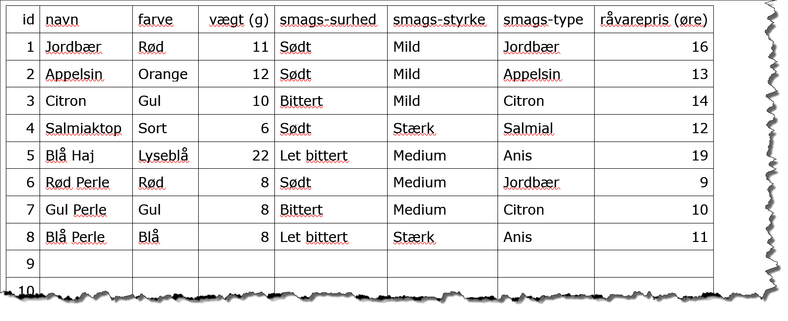

# Birgers Bolcher
### En SQL og database øvelse til Nodejs
Birger fik en bog om bolcher til sin fødselsdag da han blev 14 år. Siden har han eksperimenteret med fremstilling af mange forskellige bolcher og han har flittigt delt smagsprøver ud til sin familie og venner.

Nu er efterspørgslen blevet så stor, at han vil starte en egentlig produktion.  Birger har foreløbig otte forskellige bolchetyper han vil producere og han har lavet en tabel med navne, farver, smag osv. til sine bolcher.
Birger har ambitioner, så han vil have en webside med sine bolcher.

Det er her du kommer ind i billedet. Du får til opgave at sætte en database op og lave en række forskellige udtræk til visning i konsollen i første omgang - senere på en simpel webside.
Database skal være en MySQL database og udtrækket skal foregå via nodejs.

> Da det hele nu er en øvelse hvor du skal lære og træne SQL, sætte en database op og connecte via nodejs, så er det vigtigt at du løser opgaven slavisk og selvstændigt.
**Det handler ikke om at få løsningen**, for så er det ikke længere en øvelse - men du skal selv finde løsningen ved at læse og prøve dig frem – heri opstår læring som er målet med opgaven.

W3Schools er en rigtig god reference til det du søger i <a href="https://www.w3schools.com/sql" target="_blank">SQL</a>

Forklaring følger også i undervisningen

## Øvelse 1
1.1	Opret en database kaldet birgers_bolcher med én tabel kaldet bolche

1.2	Tabellen skal indeholde de viste felter og data – du bestemmer både feltnavne og datatyper

 
## Øvelse 2
Skriv en sql sætning for hver af følgende

2.1	Udskriv alle informationer om alle bolcher.

2.2	Find og udskriv navnene på alle de røde bolcher.

2.3	Find og udskriv navnene på alle de røde og de blå bolcher, i samme SQL udtræk.

2.4	Find og udskriv navnene på alle bolcher, der ikke er røde, sorteret alfabetisk.

2.5	Find og udskriv navnene på alle bolcher som starter med et “B”.

2.6	Find og udskriv navene på alle bolcher, hvor der i navnet findes mindst ét “e”.

2.7	Find og udskriv navn og vægt på alle bolcher der vejer mindre end 10 gram, sorter stigende efter vægt.

2.8	Find og udskriv navne på alle bolcher, der vejer mellem 10 og 12 gram (begge tal inklusiv), sorteret alfabetisk og derefter vægt.

2.9	Find og udskriv de tre største (tungeste) bolcher.

2.10 Udskriv alle informationer om et tilfældigt bolche, udvalgt af systemet (sql).

## Øvelse 3
3.1	Normaliser tabellen Bolcher så der dannes ”domænetabeller” til de felter hvor flere bolcher ofte har samme værdi.

## Øvelse 4

4.1	Gentag øvelse 2, men nu med inner joins
## Øvelse 5
Nettopris for et bolche er råvareprisen plus 250 % (begge uden moms) 

5.1	Udskriv en prisliste med bolchenavn og kilopris henholdsvis med og uden moms

## Øvelse 6

6.1	Løs opgave 2.3 ved brug af IN

6.2	Løs opgave 2.4 ved brug af NOT IN

6.3	Udskriv hvor mange bolscher der vejer under 15 g.

6.4	Udskriv hvor mange forskellige forskellige bolcher der er i tabellen

6.5	Udskriv gennemsnitsprisen per bolche

6.6	Udskriv navn og pris på det dyreste og billigste bolche
